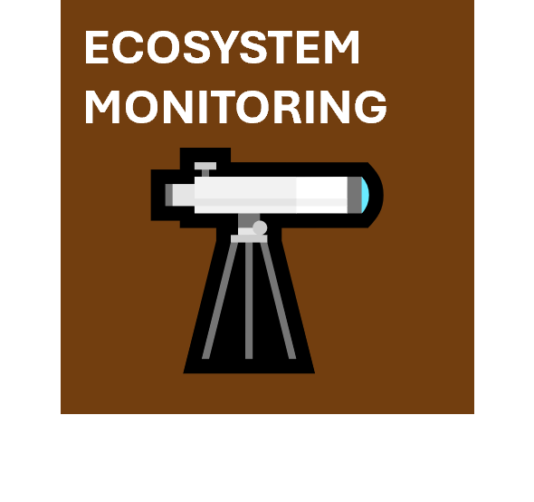
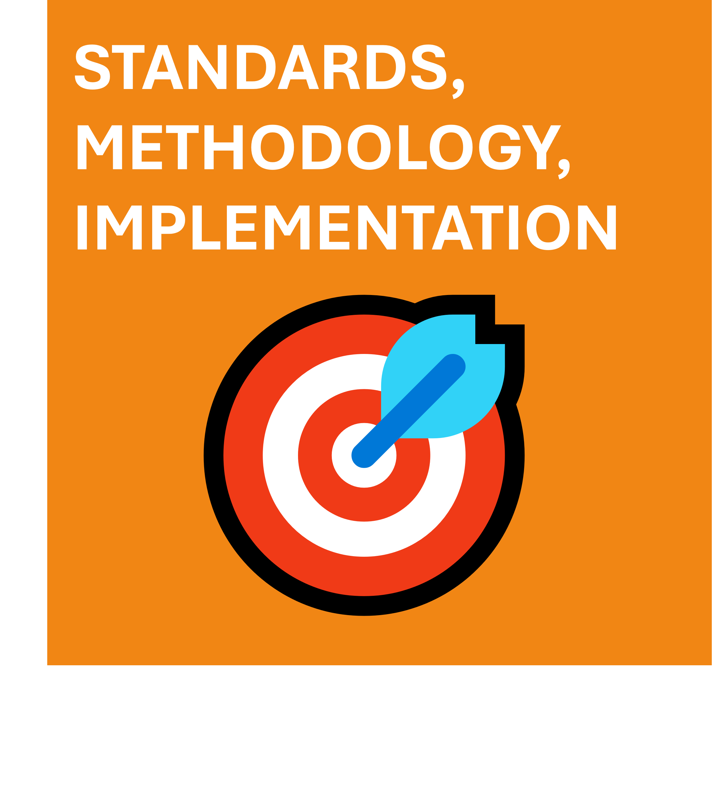
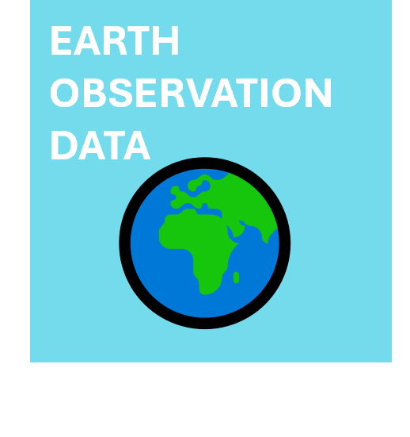
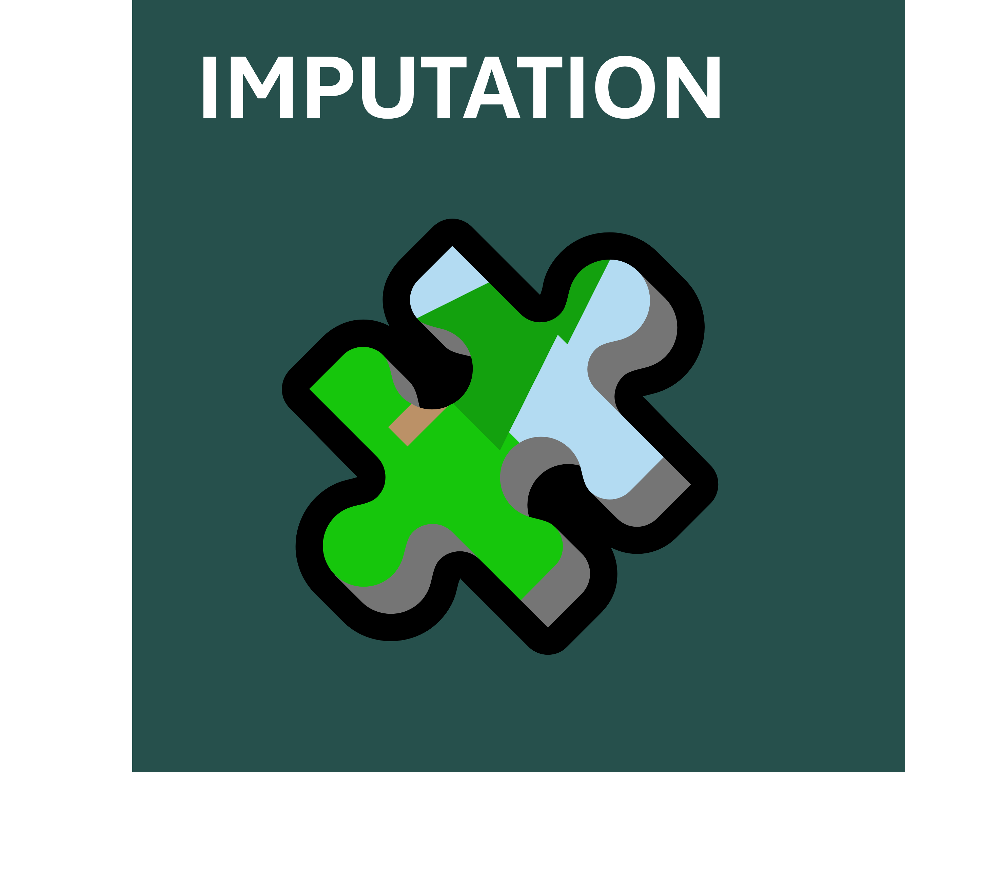
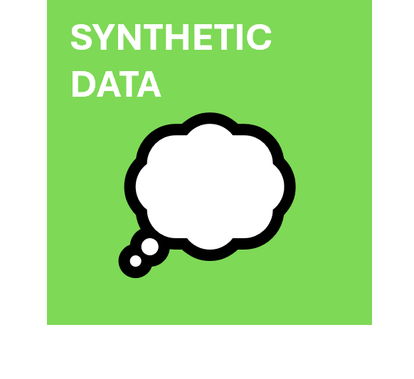

# **AIML4OS** is a one-stop-shop of resources to support the use of AI and ML in the production official statistics

**AI and Machine Learning for Official Statistics (AIML4OS)** is an ESSnet project aimed at delivering a comprehensive suite of resources, guidelines, methodologies and use cases for the implementation of AI/ML in Official Statistics. There are 15 funded countries in the consortium. The project is running from April 2024 to March 2028.

  

  

  

  
  

  

  
  

  

  
  

  

  
  

  

  
  

  

  

  

  

  

  
  

  

  
  

  

  
  

  

  
  

  

  
  

  

  

  

  

  

  
  

  

  
  

  

  
  

  

  

 

## Links

- [LinkedIn](https://www.linkedin.com/company/essnet-aiml4os/)
- [Eurostat CROS](https://cros.ec.europa.eu/dashboard/aiml4os)

<!-- 
 -->

<!--  -->

<!-- 
 -->

---

Last updated: `r Sys.Date()`

